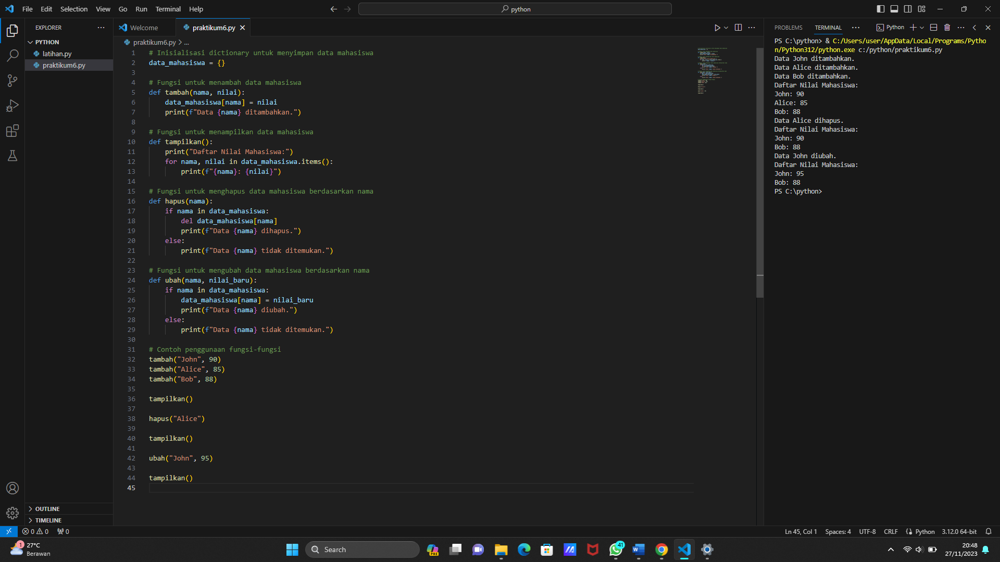
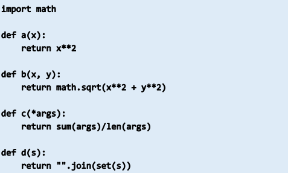
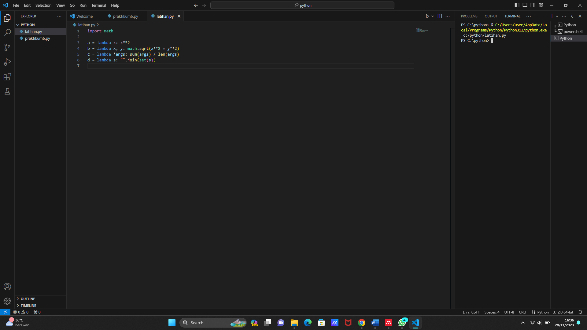

<h1> praktikum 6 </h1>
<h2> Membuat program sederhana dengan mengaplikasikan penggunaan fungsi
yang akan menampilkan daftar nilai mahasiswa, </h2>

<h2> Langkah 1: </h2>

 &nbsp; Inisialisasi dictionary data_mahasiswa sebagai wadah untuk menyimpan data mahasiswa. Dictionary ini akan memiliki format {nama: nilai}.

<h2> Langkah 2: </h2>
<h3> Fungsi tambah(nama, nilai) </h3>
 &nbsp; Fungsi ini digunakan untuk menambahkan data mahasiswa ke dalam dictionary.
 
- &nbsp; Menerima dua parameter, nama (nama mahasiswa) dan nilai (nilai mahasiswa).
- &nbsp; Menambahkan data ke dalam dictionary data_mahasiswa dengan kunci nama dan nilai nilai.
- &nbsp; Mencetak pesan konfirmasi bahwa data telah ditambahkan.

<h2> Langkah 3: </h2>
<h3> Fungsi tampilkan() </h3>
 &nbsp; Fungsi ini digunakan untuk menampilkan daftar nilai mahasiswa.
 
- &nbsp; Mencetak header "Daftar Nilai Mahasiswa".
- &nbsp; Menggunakan loop for untuk mencetak setiap pasangan kunci-nilai dari dictionary data_mahasiswa.

<h2> Langkah 4: </h2>
<h3> Fungsi hapus(nama) </h3>
 &nbsp; Fungsi ini digunakan untuk menghapus data mahasiswa berdasarkan nama.
 
- &nbsp; Memeriksa apakah nama mahasiswa ada dalam dictionary data_mahasiswa.
- &nbsp; Jika ada, menghapus data dengan kunci nama.
- &nbsp; Jika tidak, mencetak pesan bahwa data tidak ditemukan.

<h2> Langkah 5: </h2>
<h3> Fungsi ubah(nama, nilai_baru) </h3>
 &nbsp; Fungsi ini digunakan untuk mengubah data mahasiswa berdasarkan nama.
 
- &nbsp; Memeriksa apakah nama mahasiswa ada dalam dictionary data_mahasiswa.
- &nbsp; Jika ada, mengganti nilai dengan nilai baru.
- &nbsp; Jika tidak, mencetak pesan bahwa data tidak ditemukan.

<h2> Langkah 6: </h2>
<h3> Penggunaan Fungsi </h3>
 &nbsp; Contoh penggunaan fungsi-fungsi tersebut:
 
- &nbsp; Menambahkan tiga data mahasiswa.
- &nbsp; Menampilkan daftar nilai mahasiswa.
- &nbsp; Menghapus data mahasiswa dengan nama "Alice".
- &nbsp; Menampilkan daftar nilai mahasiswa setelah penghapusan.
- &nbsp; Mengubah nilai mahasiswa "John" menjadi 95.
- &nbsp; Menampilkan daftar nilai mahasiswa setelah perubahan.

<h2> Berikut adalah contohnya </h2>

<h2> Berikut adalah flowchartnya </h2>

<h1> latihan 1 </h1>
<h2> Mengubah kode dibawah ini menjadi fungsi menggunakan lambda. </h2>

<h2> Berikut adalah kode yang diubah menggunakan lambda: </h2>

<h3> Dengan menggunakan lambda, kita dapat menyederhanakan fungsi-fungsi kecil seperti ini tanpa perlu mendefinisikan secara terpisah dengan kata kunci def. </h3>
